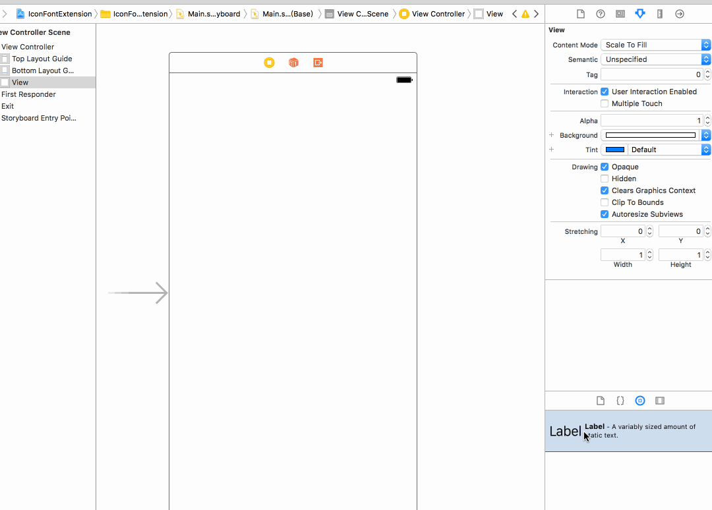
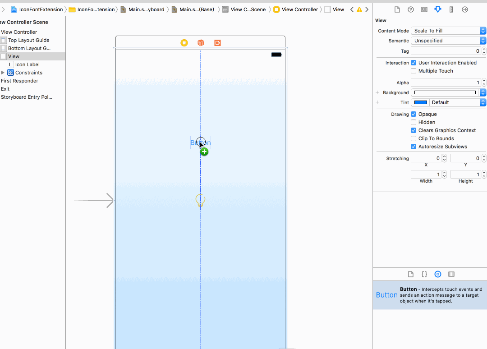
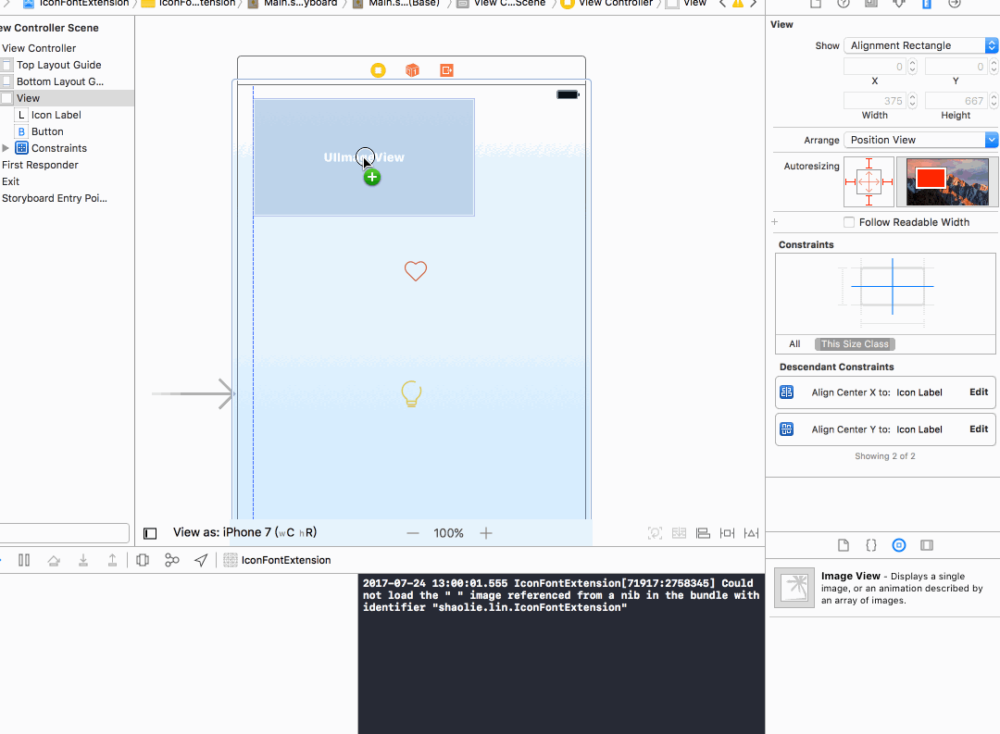

# Storyboard 使用

### IconLabel使用



### IconButton使用



### IconImageView使用


# 代码使用

### IconLabel使用

``` objectiveC
IconLabel *iconLabel = [[IconLabel alloc] initWithIconName:@"灯泡" fontSize:30];
iconLabel.frame = CGRectMake(100, 400, iconLabel.frame.size.width, iconLabel.frame.size.height);
```

### IconButton使用
``` objectiveC
- (void)viewDidLoad {
    [super viewDidLoad];
    
    IconButton *iconBtn = [[IconButton alloc] initWithIcon:@"空红心" color:[UIColor yellowColor] selectedIcon:@"实红心" selectedColor:[UIColor redColor]];
    iconBtn.frame = CGRectMake(160, 400, 40, 40);
    [iconBtn addTarget:self action:@selector(touchBtn:) forControlEvents:UIControlEventTouchUpInside];
    iconBtn.size = 30;
    [self.view addSubview:iconBtn];
}

- (void)touchBtn:(UIButton *)btn {
    btn.selected = !btn.selected;
}
```

### IconImageView使用

``` objectiveC
IconImageView *imageView = [[IconImageView alloc] initWithImage:[UIImage iconWithInfo:[IconInfo iconInfoWithText:@"back" size:24 color:[UIColor blackColor]]]];
imageView.frame = CGRectMake(220, 400, 30, 30);

IconImageView *imageView2 = [[IconImageView alloc] init];
imageView2.tintColor = [UIColor purpleColor];
imageView2.frame = CGRectMake(260, 400, 30, 30);
imageView2.iconName = @"灯泡";
```